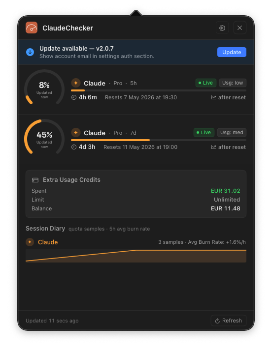
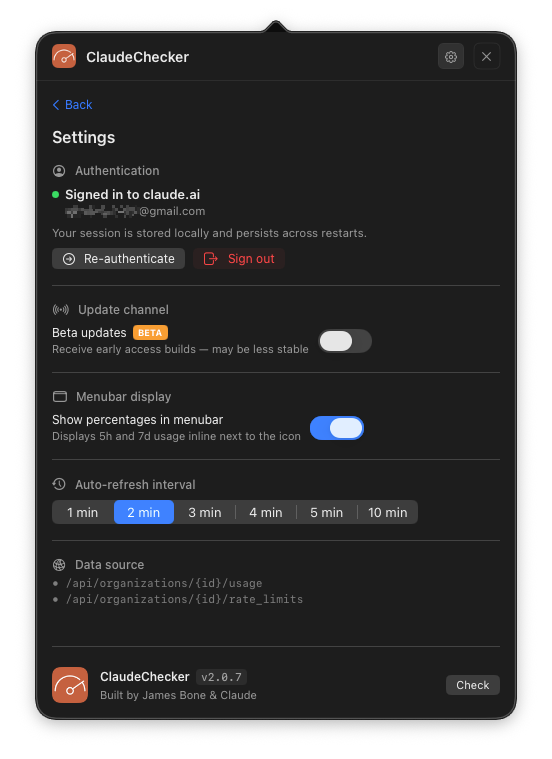
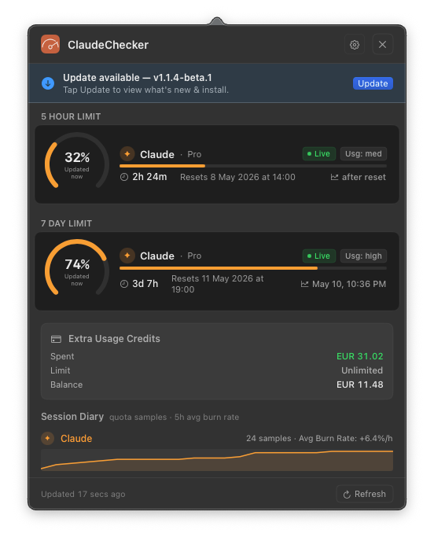

<div align="center">


# ClaudeChecker

**A native macOS menubar app for monitoring your Claude AI usage limits in real time.**

[](https://www.apple.com/macos/)
[](https://swift.org)
[](https://github.com/superdooper86/claudechecker/releases)
[](LICENSE)

</div>

---

## Overview

ClaudeChecker sits quietly in your menubar and tracks your Claude API quota usage across both the 5-hour and 7-day windows — so you always know how much runway you have left before hitting a rate limit.

No API key required. It reads directly from your `claude.ai` session using a built-in browser login — the same data the Claude web app uses.

---

## Screenshots

<div align="center">

<table>
  <tr>
    <td align="center"><br/><sub>Main window</sub></td>
    <td align="center"><br/><sub>Settings</sub></td>
  </tr>
  <tr>
    <td align="center"><br/><sub>Update available</sub></td>
    <td align="center"><br/><sub>System notification</sub></td>
  </tr>
</table>

<br/>

**Menubar display**<br/>

&nbsp;


</div>

---

## Features

### 📊 Usage Monitoring
- **Real-time quota tracking** for both 5-hour and 7-day windows
- Circular gauge with percentage, time remaining, and reset time for each window
- **Extra usage credits** display (monthly limit vs used, with colour-coded progress bar)
- Usage level badge — Low / Med / High — at a glance

### 🖥 Menubar Display
- Compact **percentage display** directly in the menubar: `◔ 22%  35%`
- Toggle between percentage view and icon-only in Settings
- Auto-updates after every refresh cycle

### 🔄 Auto Refresh
- Configurable refresh interval: **1 / 2 / 3 / 4 / 5 / 10 minutes**
- Update check runs alongside every data refresh
- Persists your chosen interval across restarts

### 🔐 Authentication
- Built-in login via `WKWebView` — sign into claude.ai once, session persists
- No API key, no credentials stored beyond the macOS WKWebsiteDataStore
- Re-authenticate any time from Settings → Sign in again

### 🔔 Update System
- **Automatic update detection** — checks for new versions on launch and on each refresh cycle
- Floating **notification popup** appears near the menubar icon when a new version is found
- One-click install: downloads, unpacks, replaces, and **relaunches automatically**
- **Post-update success notification** — compact toast confirms the new version on first launch
- **Beta channel** — opt in to early access builds via Settings toggle
  - Beta badge shown even when toggle is off, as a teaser
  - Install gated behind the toggle

### 📋 Session Diary
- Sparkline chart showing quota burn history over the session
- Average burn rate calculated from the 5-hour window

### ⚙️ Settings
- Authentication management
- Menubar display toggle
- Refresh interval picker
- Beta channel toggle
- About section with version, build info, and update check

### 🖱 Right-Click Menu
- Right-click the menubar icon for quick **Show** and **Quit** options
- ✕ button hides the panel (app stays running in menubar)
- Full quit via right-click → Quit

---

## Requirements

- macOS 13 Ventura or later
- Xcode 15+ (to build from source)
- A claude.ai account

---

## Installation

### Download (recommended)
1. Go to [Releases](https://github.com/superdooper86/claudechecker/releases)
2. Download `ClaudeChecker.zip` from the latest release
3. Unzip and drag `ClaudeChecker.app` to `/Applications`
4. Open from Applications — it will appear in your menubar

### Build from source
```bash
git clone https://github.com/superdooper86/claudechecker.git
open ClaudeChecker/ClaudeChecker.xcodeproj
```
Then in Xcode: set your Team under Signing & Capabilities, then **⌘R** to run.

---

## First Run

1. Click the menubar icon (gauge symbol)
2. If prompted — click **Sign In** and log into claude.ai in the built-in browser
3. Your usage data will appear within a few seconds

---

## Data Sources

ClaudeChecker reads from the following `claude.ai` API endpoints (authenticated via your session):

| Endpoint | Used for |
|---|---|
| `/api/bootstrap` | Organisation UUID |
| `/api/organizations/{id}/usage` | 5-hour and 7-day quota windows |
| `/api/organizations/{id}/overage_spend_limit` | Extra usage spent and monthly limit |
| `/api/organizations/{id}/prepaid/credits` | Current credit balance |

---

## Privacy

- No data leaves your machine except to `claude.ai` (your own session) and `raw.githubusercontent.com` (version check)
- Session stored in macOS `WKWebsiteDataStore.default()` — same as Safari
- No analytics, no tracking, no ads

---

## Built by

**superdooper86 & Claude**

---

<div align="center">
  <sub>ClaudeChecker is not affiliated with or endorsed by Anthropic.</sub>
</div>
